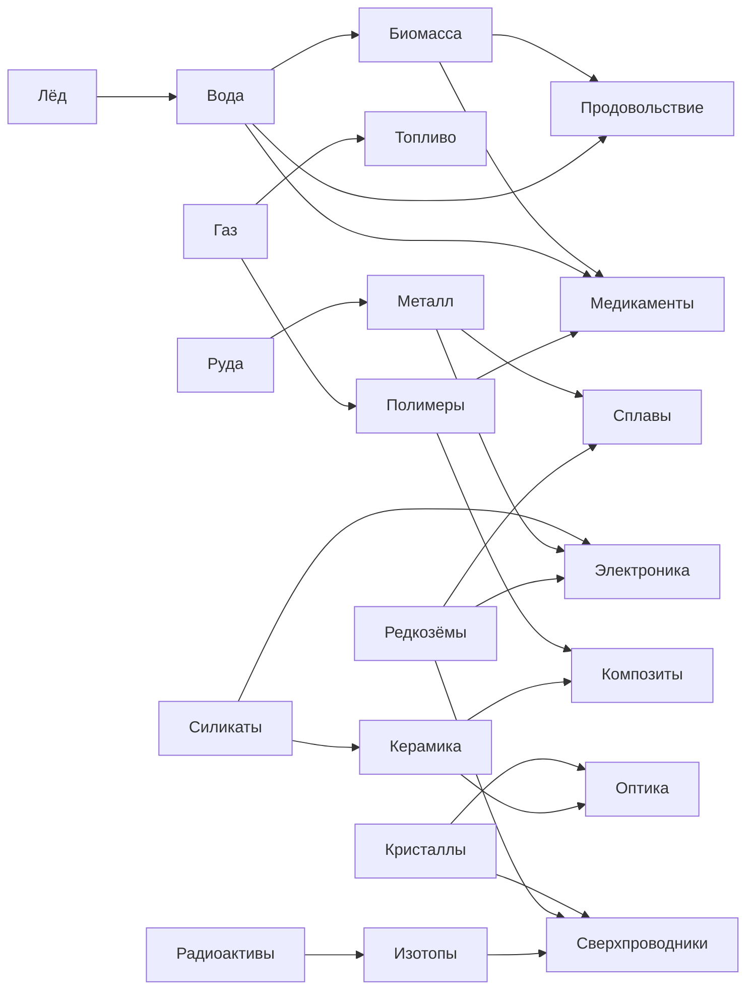
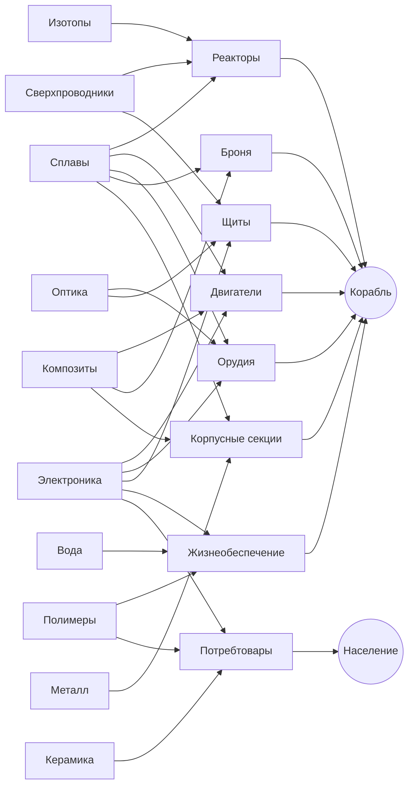

# Экономика: ресурсы, цепочки и баланс

**Дополнение к `galaxy-sim-spec.md`, раздел 5.**
**Версия данных:** resources 1.0, recipes 1.1, buildings 1.0
**Статус:** проверено валидатором, ошибок нет

Файлы данных лежат в `galaxy-sim-data/` и предназначены для пакета `sim-data`:

```
resources.json    35 ресурсов (34 в фазе 1)
recipes.json      33 партийных рецепта + 4 непрерывных процесса + 6 стоков
buildings.json    36 зданий
validate.mjs      валидатор графа; node validate.mjs
chain-graph.mmd   диаграмма, генерируется валидатором
```

---

## 1. Принципы, из которых выведены все числа

**Логистика существует только благодаря дефициту и расстоянию.** Если система
самодостаточна, вся система цепочек схлопывается в набор изолированных заводиков.

**Объём падает с уровнем передела.** Это ключевой и, пожалуй, самый недооценённый
параметр. Единица руды занимает 1.0 объёма, единица металла — 0.6, сплавов — 0.4,
сверхпроводников — 0.15. Валидатор подтверждает: при переделе плотность стоимости
растёт в 5–9 раз, а на паре кристаллы → сверхпроводники — в 43 раза.

Следствие: возить сырьё через полгалактики экономически бессмысленно. Выгодно ставить
плавильню у месторождения и везти уже металл. **Промышленная география — рудная окраина
с местным переделом, компонентный пояс в середине, верфи в метрополии — возникает сама,
без единого правила на этот счёт.**

**Корпусные секции намеренно сделаны громоздкими** (объём 2.0 — самый большой в игре).
Это разворачивает логику наоборот: их невыгодно возить вообще, поэтому верфь притягивает
к себе всю тяжёлую промышленность. Верфь становится не точкой, а промышленным районом.

**Редкость возникает из географии, а не из себестоимости.** Себестоимость добычи редкого
сырья держится в коридоре 2.8–3.2× от обычного. Всё остальное даёт теневая цена там, где
месторождения нет. Иначе редкость учитывалась бы дважды.

---

## 2. Ресурсы

Столбец «стоимость» — расчёт валидатора методом итеративной релаксации по всему графу
(энергия 0.03 у.е., труд 0.5 у.е. за человеко-день). «Плотность» = стоимость / объём:
чем выше, тем выгоднее возить.

### Уровень 0 — энергия

| id | Название | Особенность |
|---|---|---|
| `energy` | Энергия | **Не транспортируется.** Локальная сеть с ёмкостью буфера, излишки теряются |

### Уровень 1 — сырьё

| id | Название | Редкость | Стоимость | Объём | Плотность |
|---|---|---|---|---|---|
| `ice` | Лёд | обычное | 0.18 | 1.00 | 0.18 |
| `silicates` | Силикаты | обычное | 0.18 | 1.00 | 0.18 |
| `ore` | Руда | обычное | 0.21 | 1.00 | 0.21 |
| `gas` | Газ | обычное | 0.27 | 1.20 | 0.22 |
| `biomass` | Биомасса | обычное | 0.56 | 0.90 | 0.62 |
| `rare_earth` | Редкозёмы | **редкое** | 0.79 | 0.70 | 1.13 |
| `crystals` | Кристаллы | **редкое** | 0.88 | 0.60 | 1.46 |
| `radioactives` | Радиоактивы | **редкое** | 0.89 | 0.80 | 1.11 |
| `exotic_matter` | Экзотическая материя | очень редкое | — | 0.30 | фаза 2 |

Биомасса дороже прочего обычного сырья, потому что агрокомплекс потребляет воду — это
намеренный кросс-линк, делающий лёд значимым на аграрных мирах.

### Уровень 2 — первичный передел

| id | Название | Стоимость | Объём | Плотность |
|---|---|---|---|---|
| `water` | Вода | 0.34 | 0.80 | 0.42 |
| `ceramics` | Керамика | 0.82 | 0.50 | 1.63 |
| `food` | Продовольствие | 0.95 | 0.70 | 1.36 |
| `polymers` | Полимеры | 1.01 | 0.50 | 2.02 |
| `metal` | Металл | 1.15 | 0.60 | 1.92 |
| `fuel` | Топливо | 1.28 | 0.70 | 1.83 |
| `isotopes` | Изотопы | 2.86 | 0.40 | 7.15 |

### Уровень 3 — компоненты

| id | Название | Стоимость | Объём | Плотность |
|---|---|---|---|---|
| `medicine` | Медикаменты | 2.61 | 0.20 | 13.06 |
| `composites` | Композиты | 2.75 | 0.35 | 7.85 |
| `electronics` | Электроника | 3.48 | 0.30 | 11.59 |
| `alloys` | Сплавы | 3.78 | 0.40 | 9.44 |
| `optics` | Оптика | 4.39 | 0.25 | 17.57 |
| `superconductors` | Сверхпроводники | **9.55** | 0.15 | **63.66** |

### Уровень 4 — системы и данные

| id | Название | Стоимость | Объём | Плотность |
|---|---|---|---|---|
| `life_support` | Системы жизнеобеспечения | 6.68 | 0.40 | 16.69 |
| `data_physics` | Данные: физика | 7.88 | 0.05 | 157.6 |
| `data_bio` | Данные: биология | 10.07 | 0.05 | 201.3 |
| `data_engineering` | Данные: инженерия | 14.14 | 0.05 | 282.9 |
| `armor` | Броневые плиты | 15.22 | 0.80 | 19.02 |
| `thrusters` | Двигательные блоки | 31.24 | 0.50 | 62.49 |
| `weapons` | Орудийные системы | 32.40 | 0.45 | 71.99 |
| `reactors` | Реакторные блоки | 39.43 | 0.50 | 78.86 |
| `shields` | Щитовые эмиттеры | 41.82 | 0.35 | 119.5 |

Данные имеют минимальный объём (0.05) и огромную плотность стоимости — возить их дёшево,
поэтому научная колония на дальней окраине жизнеспособна. Но именно поэтому маршрут
доставки данных в Академию становится соблазнительной целью для рейда.

### Уровень 5 — финал

| id | Название | Стоимость | Объём | Плотность |
|---|---|---|---|---|
| `consumer_goods` | Потребительские товары | 3.56 | 0.40 | 8.90 |
| `station_parts` | Станционные модули | 46.31 | 1.50 | 30.88 |
| `hull_frames` | Корпусные секции | 67.56 | **2.00** | 33.78 |

---

## 3. Граф цепочек

### Сырьё → компоненты



### Компоненты → системы и финал



Материальных циклов в графе нет — валидатор проверяет это на каждом прогоне. Четыре
цикла проходят через энергию (изотопы → энергия → изотопы, топливо → энергия → топливо):
это нормальная обратная связь энергетики, она разрешается поиском фиксированной точки.

---

## 4. Рецепты

Полные числа — в `recipes.json`. Здесь сводка по уровням.

| Рецепт | Входы | Выход | Дней | Раб. |
|---|---|---|---|---|
| `mine_ore` | энергия 5 | руда 20 | 2 | 4 |
| `drill_ice` | энергия 5 | лёд 18 | 2 | 3 |
| `collect_gas` | энергия 8 | газ 16 | 2 | 4 |
| `quarry_silicates` | энергия 5 | силикаты 18 | 2 | 3 |
| `farm_biomass` | вода 4, энергия 3 | биомасса 16 | 3 | 5 |
| `mine_rare_earth` | энергия 12 | редкозёмы 10 | 3 | 5 |
| `mine_crystals` | энергия 12 | кристаллы 9 | 3 | 5 |
| `mine_radioactives` | энергия 15 | радиоактивы 9 | 3 | 5 |
| `smelt_metal` | руда 12, энергия 12 | металл 6 | 2 | 4 |
| `purify_water` | лёд 12, энергия 8 | вода 10 | 1 | 2 |
| `refine_fuel` | газ 12, энергия 15 | топливо 6 | 2 | 4 |
| `synth_food` | биомасса 10, вода 5, энергия 5 | еда 12 | 2 | 4 |
| `make_polymers` | газ 10, энергия 12 | полимеры 6 | 2 | 3 |
| `fire_ceramics` | силикаты 12, энергия 18 | керамика 7 | 2 | 3 |
| `enrich_isotopes` | радиоактивы 5, энергия 30 | изотопы 4 | 3 | 4 |
| `forge_alloys` | металл 8, редкозёмы 2, энергия 18 | сплавы 5 | 3 | 5 |
| `make_electronics` | силикаты 5, металл 3, редкозёмы 2, энергия 15 | электроника 4 | 3 | 5 |
| `make_composites` | полимеры 6, керамика 5, энергия 10 | композиты 6 | 3 | 4 |
| `make_superconductors` | кристаллы 5, редкозёмы 3, изотопы 2, энергия 35 | сверхпроводники 3 | 5 | 6 |
| `make_optics` | кристаллы 4, керамика 4, энергия 12 | оптика 3 | 3 | 4 |
| `make_medicine` | биомасса 6, вода 4, полимеры 2, энергия 10 | медикаменты 5 | 3 | 4 |
| `make_reactors` | сплавы 6, сверхпров. 3, изотопы 2, энергия 25 | реакторы 2 | 6 | 7 |
| `make_thrusters` | сплавы 6, композиты 5, электроника 3, энергия 20 | двигатели 2 | 5 | 6 |
| `make_weapons` | сплавы 7, электроника 4, оптика 2, энергия 20 | орудия 2 | 5 | 6 |
| `make_shields` | сверхпров. 4, оптика 3, электроника 3, энергия 25 | щиты 2 | 6 | 7 |
| `make_armor` | сплавы 9, композиты 6, энергия 12 | броня 4 | 4 | 5 |
| `make_life_support` | полимеры 5, электроника 2, вода 5, энергия 10 | жизнеобесп. 3 | 3 | 4 |
| `make_hull_frames` | сплавы 14, композиты 10, металл 12, энергия 30 | корпуса 2 | 8 | 10 |
| `make_station_parts` | сплавы 10, композиты 7, электроника 4, энергия 22 | станц. модули 2 | 6 | 7 |
| `make_consumer_goods` | полимеры 6, электроника 3, керамика 5, энергия 12 | потребтовары 8 | 3 | 5 |
| `research_physics` | кристаллы 3, энергия 30 | данные: физика 3 | 5 | 8 |
| `research_engineering` | сплавы 3, электроника 3, энергия 20 | данные: инженерия 3 | 5 | 8 |
| `research_bio` | биомасса 8, медикаменты 2, энергия 15 | данные: биология 3 | 5 | 8 |

---

## 5. Энергетика: три оси вместо одной

Энергия не транспортируется, поэтому каждая колония решает вопрос питания сама. Три
станции различаются **не по силе, а по профилю**:

| Станция | Выход/день | Цена за единицу | Слотов | Объём подвоза на 100 энергии |
|---|---|---|---|---|
| Солнечная батарея | 15 | **0.033** | 1 | **0.00** |
| Ядерная станция | 45 | 0.121 | 1 | 1.07 |
| Термоядерная станция | **75** | 0.093 | 1 | 3.27 |

Читать это надо так:

- **Солнце** — дешевле всех и вообще не требует подвоза, но чтобы запитать промышленный
  мир, придётся отдать под батареи половину слотов. На развитой планете это неприемлемо.
- **Термояд** — лучший за слот и дешевле деления, но требует **втрое больше хаулинга**.
  А топливо для него — то же самое топливо, на котором летает флот (решение №14). Во
  время войны промышленность метрополии тускнеет буквально из-за фронта. Эффект намеренный.
- **Деление** — выигрывает там, где решает не кредит, а длина плеча снабжения: передовые
  базы, осаждённые системы, дальние окраины.

Первый прогон валидатора показал, что термояд доминирует деление по обеим экономическим
осям сразу, то есть деление было бы мёртвым контентом. Добавление третьей оси —
логистической нагрузки — вернуло ему нишу.

**Годовой расход одной станции:**

| Станция | Потребление за год | В пересчёте на сырьё |
|---|---|---|
| Ядерная | 438 изотопов | **548 радиоактивов** |
| Термоядерная | 1278 топлива | **2555 газа** |

Это принципиально: **стратегическую ценность радиоактивам придаёт энергетика, а не
кораблестроение.** Целому крейсеру нужно всего 10 радиоактивов, а одна ядерная станция
съедает 548 в год. В развёртке одного корабля это было не видно вообще.

---

## 6. Население

Непрерывный поток, на тысячу населения в день:

| Ресурс | Норма/день |
|---|---|
| Продовольствие | 1.00 |
| Вода | 0.80 |
| Медикаменты | 0.12 |
| Потребительские товары | 0.25 × уровень развития |

Деградация плавная — голод не бинарен:

| Удовлетворение | Рост населения | Недовольство |
|---|---|---|
| 100% | +1.00 | 0.00 |
| 80% | +0.40 | 0.15 |
| 50% | 0.00 | 0.45 |
| 30% | −0.35 | 0.80 |
| 0% | −1.00 | 1.00 |

Потребность в потребительских товарах умножается на уровень развития колонии: голая
окраина почти не требует, метрополия требует много. Это и есть связка с решением №15 —
недовольство входит в формулу напряжения региона, поэтому **технология фермерства
укрепляет империю от раскола**, хотя слово «фермерство» не встречается ни в описании
технологии, ни в формуле напряжения.

---

## 7. Стратегические горлышки

Четыре точки, вокруг которых будет строиться вся геополитика:

| Ресурс | Что гейтит | Почему важен |
|---|---|---|
| **Редкозёмы** | сплавы, электроника, сверхпроводники | Универсальное промышленное горлышко: входит в конструкционку, электронику и сверхпроводники одновременно. Нужны всем и всегда |
| **Кристаллы** | сверхпроводники, оптика, физическая наука | Гейтят качество оружия, щитов и весь физический раздел исследований |
| **Радиоактивы** | изотопы, реакторы, ядерная энергетика | Гейтят энергетику. Расход постоянный, а не разовый |
| **Сверхпроводники** | реакторы, щиты | Главное горлышко верхних тиров: требуют **три редких входа сразу**. Контроль над ними равен контролю над качественным флотом |

Развёртка условного крейсера через MRP (корпуса ×4, реакторы ×2, двигатели ×3, орудия ×4,
щиты ×3, броня ×6, жизнеобеспечение ×1) даёт:

| Сырьё | Требуется | |
|---|---|---|
| Руда | 300.1 | |
| Силикаты | 93.7 | |
| Газ | 63.6 | |
| Редкозёмы | 46.0 | **редкое** |
| Кристаллы | 26.3 | **редкое** |
| Радиоактивы | 10.0 | **редкое** |
| Лёд | 2.0 | |
| **Итого** | **796 у.е.** | |

Ключевое: **один корабль требует все три редких ресурса сразу**. Ни одна фракция не
сможет строить полноценный флот, сидя на одном месторождении. Экспансия и войны за
конкретные системы возникают из этой таблицы, а не из правил поведения ИИ.

---

## 8. Что нашёл валидатор

Первый прогон вскрыл три содержательные проблемы. Все три — примеры того, почему
балансировать «на глаз» бессмысленно.

**Изотопы стоили 12.23** при том, что остальные ресурсы второго уровня укладывались в
0.33–1.50. Ядерная станция при таких числах давала энергию в девять раз дороже солнечной,
то есть не была бы построена никогда. Исправлено: выход 2 → 4, срок 4 → 3 дня. Стало 2.86.

**Редкое сырьё стоило в 7–11 раз дороже обычного по себестоимости.** Редкость учитывалась
дважды — и географией, и ценой добычи. Исправлено поднятием выхода редких шахт; коридор
приведён к 2.8–3.2×.

**Энергия составляла 7% стоимости рецепта**, то есть экономически её не существовало, и
вся цепочка газ → топливо → термояд была бессмысленной. Исправлено: энергозатраты всех
рецептов подняты в ~2.5×, выработка станций — соответственно.

Второй прогон вскрыл четвёртую: **термояд доминировал деление по обеим осям**. Исправлено
не числами, а введением третьей оси измерения — логистической нагрузки.

Текущее состояние:

```
Материальных циклов:  0                     ✓
Ошибок целостности:   0                     ✓
Выбросы по уровням:   нет ни на одном       ✓
Редкое / обычное:     2.8–3.2× (коридор 2–5) ✓
Переработка у источника: рост плотности 2.4–43× ✓
```

---

## 9. Как пользоваться

```bash
cd galaxy-sim-data
node validate.mjs          # выход 0 = данные валидны
```

Валидатор проверяет ссылочную целостность, отсутствие материальных циклов, отсутствие
мёртвых узлов, привязку рецептов к зданиям; считает экономическую стоимость всего графа,
плотность стоимости, глубину цепочек, выбросы внутри уровней, профиль энергетики и
развёртку флота в сырьё. Заодно генерирует `chain-graph.mmd`.

**Его следует поставить в CI вместе с golden-run** (раздел 14 основного ТЗ). Любая правка
чисел в JSON немедленно проверяется на согласованность, а отчёт по стоимостям показывает,
не уехал ли баланс.

Экономическая модель валидатора — приближение: она считает **себестоимость производства**
и намеренно не учитывает дефицит, расстояние и теневые цены. Это разделение сознательное:
себестоимость должна быть ровной и предсказуемой, а вся драма обязана рождаться из
географии во время симуляции. Настоящая проверка — балансировочный стенд из раздела 14.3
основного ТЗ, гоняющий 50 seed'ов по 1000 лет.

---

## 10. Что осталось

- **Альтернативные рецепты** — второй способ получить тот же ресурс с другими входами.
  Это то, что даёт экономике устойчивость к блокаде и фракциям — стратегическую вариативность.
  Отнесено в фазу 2.
- **Побочные продукты** — обогащение даёт отходы, плавка даёт шлак. Фаза 2.
- **Экзотическая материя** и связанная с ней ветка поздней игры.
- **Модификаторы от технологий**: каждая технология добычи и переработки меняет
  соотношение вход/выход конкретных рецептов. Числа нужно задать вместе с деревом технологий.
- **Стартовые пакеты фракций**: что именно лежит на складах в нулевой тик и какие здания
  уже стоят. Критично для того, чтобы бутстрап не заклинил, и подбирается только на стенде.
- **Ёмкость месторождений**: истощаются ли шахты. Влияет на то, будут ли фракции
  переезжать, или один раз занятая система кормит вечно.
